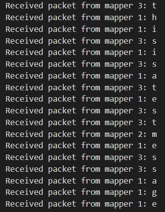
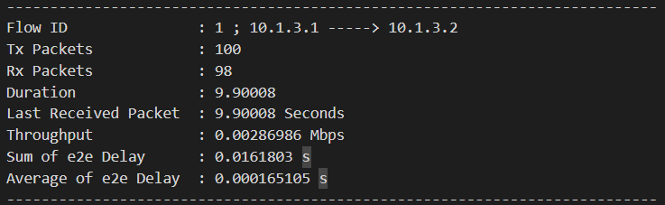
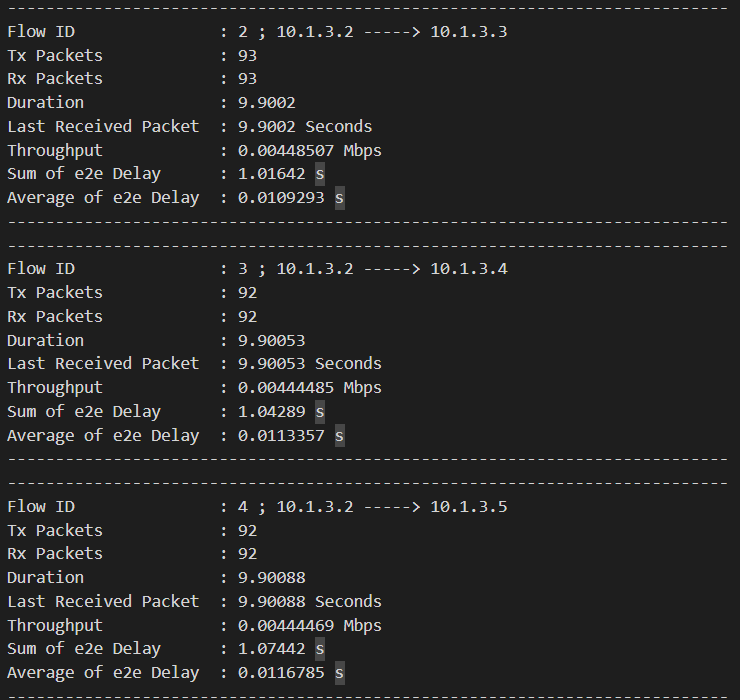
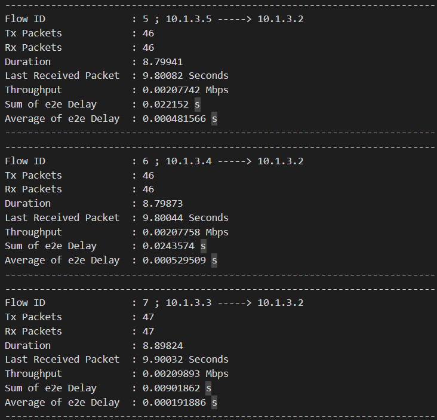
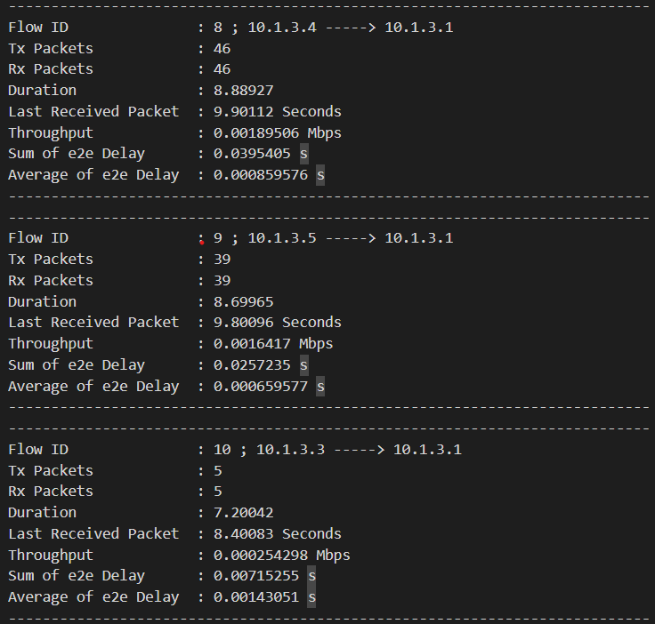

# CN_CHomeworks_2

## Contents

- [Code Documentation](#code-documentation)
- [Simulation Results Report](#simulation-results-report)

## Code Documentation

- [sample.cc](#samplecc)
- [Client Class](#client-class)
- [Mapper Class](#mapper-class)
- [Master Class](#master-class)
- [MyHeader Class](#myheader-class)
- [SetupSim Function](#setupsim-function)

## sample.cc

The `NS_LOG_COMPONENT_DEFINE` macro defines the logging component for the simulation. The component name is "WifiTopology".

The main function starts by defining four variables:

- `error` is a small value used to determine the error rate of the packets.
- `verbose` is a boolean value that determines whether the simulation output should be verbose or not.
- `duration` is the duration of the simulation in seconds.
- `tracing` is a boolean value that determines whether packet capture tracing should be enabled or not.

The `srand` function seeds the random number generator used in the simulation with the current time.

The CommandLine class is used to parse command line arguments. Two arguments are defined: verbose and tracing. These arguments are optional and can be specified at the command line when running the program.

If the verbose argument is true, the logging level for the `UdpEchoClientApplication` and `UdpEchoServerApplication` components is set to `LOG_LEVEL_INFO`.

The `SetupSim` function is called to set up the simulation. This function takes the simulation duration and error tolerance as arguments and configures the simulation accordingly.

The `Ptr<FlowMonitor>` variable flowMonitor is declared and initialized with the result of the `InstallAll` function call on a `FlowMonitorHelper` object `flowHelper`.

Two monitor functions, `ThroughputMonitor` and `AverageDelayMonitor`, are called with `flowHelper` and `flowMonitor` as arguments. These monitor functions calculate and log the throughput and average delay of the simulated network.

The `Simulator::Stop` function is called to stop the simulation after the specified duration. The `Simulator::Run` function is called to start the simulation.

## Client Class

### Description

This class implements a client that sends and receives packets over UDP using two sockets: one socket for communication with a server (called "master") and another for communication with a mapper. The class is derived from the `ns3::Application` class.

### Public Members

#### `client(uint16_t port, Ipv4InterfaceContainer &ip, uint16_t master_port, Ipv4InterfaceContainer &master_ip)`

Constructor for the client class. Initializes the port and IP address for the client's socket, as well as the port and IP address for the server's socket. It also initializes the seed for the random number generator.

Parameters:

- `port`: the port number for the client's socket
- `ip`: an object of type `Ipv4InterfaceContainer` that represents the IP address for the client's socket
- `master_port`: the port number for the server's socket
- `master_ip`: an object of type `Ipv4InterfaceContainer` that represents the IP address for the server's socket

#### `virtual ~client()`

Destructor for the client class. It has an empty implementation.

#### `uint16_t GetPort(void)`

Returns the port number for the client's socket.

Returns:

- an integer representing the port number for the client's socket.

#### `Ipv4InterfaceContainer GetIp(void)`

Returns the IP address for the client's socket.

Returns:

- an object of type `Ipv4InterfaceContainer` that represents the IP address for the client's socket.

#### `Ptr<Socket> GetSocket()`

Returns a pointer to the socket used for communication with the server.

Returns:

- a pointer to a socket object.

### Private Members

#### `void StartApplication(void)`

Callback function that is called by ns-3 when the client starts its application. It creates two sockets: one socket for communication with the server and another socket for communication with the mapper. It then generates traffic to the server.

#### `void HandleRead(Ptr<Socket> socket)`

Callback function that is called by ns-3 when a packet is received by the client. It extracts the data from the packet and prints it to the console.

Parameters:

- `socket`: a pointer to the socket object that received the packet.

#### `static void GenerateTraffic(Ptr<Socket> socket, Ipv4InterfaceContainer ip, uint16_t port, uint16_t data)`

Function that generates traffic to the server by creating packets with random data and sending them through the socket at regular intervals.

Parameters:

- `socket`: a pointer to the socket object used for sending packets.
- `ip`: an object of type `Ipv4InterfaceContainer` that represents the IP address for the socket.
- `port`: an integer representing the port number for the socket.
- `data`: an integer representing the data to be included in the packet.

Returns:

- nothing.

### Dependencies

The following libraries and header files are required to use this class:

- `cstdlib`
- `time.h`
- `stdio.h`
- `string`
- `fstream`
- `ns3/applications-module.h`
- `ns3/internet-module.h`
- `my_header.hpp`
- `utils.hpp`

## Mapper Class

The `mapper` class is a subclass of `Application` and is used to map values from a client to server via UDP. 

### Constructor

The constructor `mapper::mapper()` takes in five parameters:

- `port` - an unsigned integer (16-bit) which represents the port number.
- `ip` - an `Ipv4InterfaceContainer` object containing IP addresses for the node.
- `map_set` - a map of integer to character for mapping values from client to server.
- `size` - an integer representing the size of the map.
- `i` - an integer representing the index of the IP address in the `Ipv4InterfaceContainer` object.

### Destructor

The destructor `mapper::~mapper()` is empty.

### Public Methods

#### `StartApplication()`

This method sets up the server to listen for incoming TCP connections. It creates a TCP socket, binds the socket to a specific IP address and port, listens for incoming connections, and sets the accept callback to `HandleAccept()` method. 

#### `HandleRead(Ptr<Socket> socket)`

This method handles incoming data from the client. It reads the data from the `Packet` object, maps the data to a new value, creates a new `Packet` object with the mapped value, and sends it back to the client using UDP. 

#### `HandleAccept(Ptr<Socket> socket, const Address &from)`

This method is the accept callback set in `StartApplication()`. It sets the receive callback to the `HandleRead()` method.

### Private Members

- `port` - an unsigned integer (16-bit) which represents the port number.
- `socket` - a `Ptr<Socket>` object.
- `ip` - an `Ipv4InterfaceContainer` object containing IP addresses for the node.
- `map_set` - a map of integer to character for mapping values from client to server.
- `size` - an integer representing the size of the map.
- `i` - an integer representing the index of the IP address in the `Ipv4InterfaceContainer` object.

### Dependencies

The following header files are included:

```cpp
#include <cstdlib>
#include <time.h>
#include <stdio.h>
#include <string>
#include <fstream>

#include "ns3/applications-module.h"
#include "ns3/internet-module.h"

#include "my_header.hpp"
```

`ns3/applications-module.h` provides the `Application` base class and `ns3/internet-module.h` provides the `Ipv4InterfaceContainer` class. The `my_header.hpp` file is included, which is expected to contain a definition for a custom `MyHeader` class that is used in the code.

## Master Class

### Constructor

- `master(uint16_t port, Ipv4InterfaceContainer &ip, uint16_t mapper_1_port, uint16_t mapper_2_port, uint16_t mapper_3_port, Ipv4InterfaceContainer &mapper_ip)`: a constructor that initializes the `master` object with the given parameters.
  - `port`: a `uint16_t` representing the port number for the master node to listen on.
  - `ip`: a reference to an `Ipv4InterfaceContainer` representing the IP addresses of the master node.
  - `mapper_1_port`: a `uint16_t` representing the port number for the first mapper node to connect to.
  - `mapper_2_port`: a `uint16_t` representing the port number for the second mapper node to connect to.
  - `mapper_3_port`: a `uint16_t` representing the port number for the third mapper node to connect to.
  - `mapper_ip`: a reference to an `Ipv4InterfaceContainer` representing the IP addresses of the mapper nodes.

### Destructor

- `virtual ~master()`: a destructor for the `master` object.

### Member Functions

- `void StartApplication(void)`: a member function that starts the application by creating and binding the UDP socket to the specified local IP address and port, connecting the TCP sockets to the remote IP addresses and ports of the mapper nodes, and setting the receive callback for the UDP socket to `HandleRead()`.
- `void HandleRead(Ptr<Socket> socket)`: a member function that handles the read event on the UDP socket by receiving packets, removing the header, and sending three copies of the packet to the three mapper nodes over TCP/IP.

### Dependencies

- `cstdlib`: for `std::srand()`.
- `time.h`: for `time(0)`.
- `stdio.h`: for `printf()`.
- `string`: for `std::string`.
- `fstream`: for `std::ofstream`.
- `array`: for `std::array`.
- `ns3/applications-module.h`: for `ns3::Application` and `ns3::Packet`.
- `ns3/internet-module.h`: for `ns3::Ipv4InterfaceContainer` and `ns3::InetSocketAddress`.
- `"my_header.hpp"`: for `MyHeader`.

## MyHeader Class

The `MyHeader` class is a subclass of `Header` and provides a custom header for packet transmissions in the ns-3 network simulator. It contains methods for setting and getting data, IP addresses, and ports, as well as methods for serialization and deserialization.

### Public Methods

- `MyHeader()`:
  - Default constructor.
- `~MyHeader()`:
  - Destructor.
- `void SetData(uint16_t data)`:
  - Sets the data value of the header.
  - Parameters:
    - `data`: A 16-bit unsigned integer representing the data value to be set.
- `uint16_t GetData() const`:
  - Gets the data value of the header.
  - Returns:
    - A 16-bit unsigned integer representing the data value of the header.
- `static TypeId GetTypeId()`:
  - Gets the TypeId of the class for use in simulations.
  - Returns:
    - A `TypeId` object representing the TypeId of the class.
- `virtual TypeId GetInstanceTypeId() const`:
  - Gets the TypeId of the instance for use in simulations.
  - Returns:
    - A `TypeId` object representing the TypeId of the instance.
- `virtual void Print(std::ostream &os) const`:
  - Prints the contents of the header to the given output stream.
  - Parameters:
    - `os`: A reference to an output stream object to which the header contents will be printed.
- `virtual void Serialize(Buffer::Iterator start) const`:
  - Serializes the header to a buffer iterator.
  - Parameters:
    - `start`: A reference to a buffer iterator object representing the start of the buffer to which the header will be serialized.
- `virtual uint32_t Deserialize(Buffer::Iterator start)`:
  - Deserializes the header from a buffer iterator.
  - Parameters:
    - `start`: A reference to a buffer iterator object representing the start of the buffer from which the header will be deserialized.
  - Returns:
    - A 32-bit unsigned integer representing the number of bytes deserialized.
- `virtual uint32_t GetSerializedSize() const`:
  - Gets the size of the serialized header.
  - Returns:
    - A 32-bit unsigned integer representing the size of the serialized header.
- `void SetIp(Ipv4Address ip)`:
  - Sets the IP address of the header.
  - Parameters:
    - `ip`: An `Ipv4Address` object representing the IP address to be set.
- `Ipv4Address GetIp() const`:
  - Gets the IP address of the header.
  - Returns:
    - An `Ipv4Address` object representing the IP address of the header.
- `void SetPort(uint16_t port)`:
  - Sets the port of the header.
  - Parameters:
    - `port`: A 16-bit unsigned integer representing the port to be set.
- `uint16_t GetPort() const`:
  - Gets the port of the header.
  - Returns:
    - A 16-bit unsigned integer representing the port of the header.

### Private Members

- `uint16_t m_data`:
  - A 16-bit unsigned integer representing the data value of the header.
- `Ipv4Address m_ip`:
  - An `Ipv4Address` object representing the IP address of the header.
- `uint16_t m_port`:
  - A 16-bit unsigned integer representing the port of the header.

### Dependencies

The `MyHeader` class has the following includes:

- `cstdlib`: provides functions for handling memory allocation, random numbers, and other utility functions.
- `time.h`: provides functions for working with time and date.
- `stdio.h`: provides functions for input and output operations.
- `string`: provides classes and functions for working with strings.
- `fstream`: provides classes for working with files.

In addition, the class depends on two headers from the ns-3 network simulator library:

- `udp-header.h`: provides definitions for the User Datagram Protocol (UDP) header.
- `yans-wifi-helper.h`: provides helper classes and functions for working with the Yet Another Network Simulator (YANS) Wi-Fi model.

These dependencies suggest that the `MyHeader` class is intended for use in network simulation scenarios, and that it may be used to define custom headers for UDP packets or to manipulate YANS Wi-Fi packets.

## SetupSim Function

### Description

This function sets up a simulation environment for the network using the ns-3 simulator. It creates three node containers: one for the client, one for the master, and one for the mapper. It then sets up the Wi-Fi channel, physical layer, and the MAC layer with a specific SSID. It also sets up the error rate model for the physical layer. The function sets up the mobility model for each node and installs the Internet stack for each container. It assigns IPv4 addresses to each of the devices and populates the routing tables. Finally, it creates and installs three different applications: one client application, one master application, and three mapper applications.

### Parameters

- duration: double value indicating the duration of the simulation in seconds
- error: double value indicating the error rate of the physical layer

Return Type: void

### Dependencies

- `cstdlib`: standard library for general purpose functions
- `time.h`: header file for time related functions
- `stdio.h`: standard input/output library
- `string`: string class for manipulating strings
- `fstream`: file stream classes for working with files
- `ns3/udp-header.h`: header file for UDP header definition
- `ns3/yans-wifi-helper.h`: header file for the YANS Wi-Fi helper

### Line by Line Explanation

```c++
void SetupSim(double duration, double error) {
```

This is the function signature, which defines a function named "SetupSim" that takes two arguments: a double named "duration" and a double named "error".

```c++
NodeContainer wifiStaNodeClient;
wifiStaNodeClient.Create(1);

NodeContainer wifiStaNodeMaster;
wifiStaNodeMaster.Create(1);

NodeContainer wifiStaNodeMapper;
wifiStaNodeMapper.Create(3);
```

These lines define three NodeContainers, which are used to store nodes for a wireless network simulation. The first NodeContainer has one node, the second NodeContainer has one node, and the third NodeContainer has three nodes.

```c++
YansWifiChannelHelper channel = YansWifiChannelHelper::Default();
YansWifiPhyHelper phy;
phy.SetChannel(channel.Create());
```

These lines set up the physical layer of the wireless network simulation. The YansWifiChannelHelper class helps to configure the wireless channel, and the YansWifiPhyHelper class is used to model the physical layer of the network. The SetChannel method is used to set the channel for the physical layer, using the channel object created in the previous line.

```c++
WifiHelper wifi;
wifi.SetRemoteStationManager("ns3::AarfWifiManager");
```

These lines set up the wireless helper object, which is used to configure the MAC layer of the network. The SetRemoteStationManager method is used to set the type of remote station manager (RSM) to be used in the simulation. In this case, it is set to "ns3::AarfWifiManager", which is an implementation of the AARF (Adaptive Automatic Rate Fallback) algorithm.

```c++
WifiMacHelper mac;
Ssid ssid = Ssid("ns-3-ssid");

mac.SetType("ns3::StaWifiMac", "Ssid", SsidValue(ssid), "ActiveProbing", BooleanValue(false));
NetDeviceContainer staDeviceClient;
staDeviceClient = wifi.Install(phy, mac, wifiStaNodeClient);

mac.SetType("ns3::StaWifiMac", "Ssid", SsidValue(ssid), "ActiveProbing", BooleanValue(false));
NetDeviceContainer staDeviceMapper;
staDeviceMapper = wifi.Install(phy, mac, wifiStaNodeMapper);

mac.SetType("ns3::ApWifiMac", "Ssid", SsidValue(ssid));
NetDeviceContainer staDeviceMaster;
staDeviceMaster = wifi.Install(phy, mac, wifiStaNodeMaster);
```

These lines set up the MAC layer of the network. The WifiMacHelper object is used to configure the MAC layer, and the Ssid class is used to define the SSID (Service Set Identifier) for the network. Three NetDeviceContainers are also defined, which are used to store the network devices for the three types of nodes in the simulation: client, mapper, and master. The SetType method of the WifiMacHelper object is used to specify the type of MAC layer to be used for each type of node. For the client and mapper nodes, the type is set to "ns3::StaWifiMac", and for the master node, it is set to "ns3::ApWifiMac". The "ActiveProbing" attribute is set to "false" for the client and mapper nodes, which disables the active probing feature.

```c++
Ptr<RateErrorModel> em = CreateObject<RateErrorModel>();
em->SetAttribute("ErrorRate", DoubleValue(error));
phy.SetErrorRateModel("ns3::YansErrorRateModel");
```

Create a new rate error model object and set its error rate attribute to a value passed in as the `error` parameter. Set the error rate model for the physical layer to be the Yans error rate model.

```c++
MobilityHelper mobility;
mobility.SetPositionAllocator("ns3::GridPositionAllocator", "MinX", DoubleValue(0.0), "MinY", DoubleValue(0.0), "DeltaX", DoubleValue(3.0), "DeltaY", DoubleValue(5.0), "GridWidth", UintegerValue(6), "LayoutType", StringValue("RowFirst"));
```

Create a new mobility helper object and set its position allocator to the GridPositionAllocator. The GridPositionAllocator will allocate positions for nodes in a grid pattern. The grid will have a width of 6 nodes, with each node spaced 3 units apart in the x direction and 5 units apart in the y direction.

```c++
mobility.SetMobilityModel("ns3::RandomWalk2dMobilityModel", "Bounds", RectangleValue(Rectangle(-50, 50, -50, 50)));
mobility.Install(wifiStaNodeClient);
```

Set the mobility model for the client node to the RandomWalk2dMobilityModel, which simulates a node moving randomly within a bounded region. Set the bounds of the region to be -50 to 50 in both x and y directions. Install the mobility helper on the client node.

```c++
mobility.SetMobilityModel("ns3::ConstantPositionMobilityModel");
mobility.Install(wifiStaNodeMaster);
mobility.SetMobilityModel("ns3::ConstantPositionMobilityModel");
mobility.Install(wifiStaNodeMapper);
```

Set the mobility model for both the master and mapper nodes to be the ConstantPositionMobilityModel, which simulates a node remaining stationary at a fixed location. Install the mobility helper on both the master and mapper nodes.

```c++
InternetStackHelper stack;
stack.Install(wifiStaNodeClient);
stack.Install(wifiStaNodeMaster);
stack.Install(wifiStaNodeMapper);
```

Create a new Internet stack helper object and install it on all three types of nodes.

```c++
Ipv4AddressHelper address;
Ipv4InterfaceContainer staNodeClientInterface;
Ipv4InterfaceContainer staNodesMasterInterface;
Ipv4InterfaceContainer staNodesMapperInterface;
address.SetBase("10.1.3.0", "255.255.255.0");
staNodeClientInterface = address.Assign(staDeviceClient);
staNodesMasterInterface = address.Assign(staDeviceMaster);
staNodesMapperInterface = address.Assign(staDeviceMapper);
```

Create a new IPv4 address helper object and assign IP addresses to the client, master, and mapper nodes using the specified address base and subnet mask. Store the resulting interfaces in separate interface containers.

```c++
Ipv4GlobalRoutingHelper::PopulateRoutingTables();
```

Use the global routing helper to populate the routing tables for all nodes in the simulation.
The rest of the function sets up and configures applications for a simulation. It assumes the existence of some variables and objects in the simulation that are not shown in the code snippet.

The first line initializes a variable `port` with a value of `1102`.

The next several lines create and configure various applications for the simulation. Each application is created using the `CreateObject` method, which takes several arguments depending on the specific application being created. The applications are of types `client`, `master`, and `mapper`.

For each application created, the appropriate node is obtained (e.g., `wifiStaNodeClient.Get(0)` obtains the first client node), and the application is added to it using the `AddApplication` method. The start and stop times for each application are then set using the `SetStartTime` and `SetStopTime` methods, with the start time set to 0 seconds and the stop time set to a duration that is not shown in the code snippet (presumably this is defined elsewhere in the simulation). 

The `mapper` applications are created with additional arguments that specify their ID and other configuration details. The `mapper` applications are added to different nodes, with `mapperApp_1` added to node 1, `mapperApp_2` added to node 0, and `mapperApp_3` added to node 2.

## Simulation Results Report

This program sends a burst of data in which, each letter is sent every 0.1s. The sent string is defined as a constant in the consts.hpp. The client will print every character that it receives from the mappers:



To test and find the Throughput and Avg e2e delay, we use the `FlowMonitor`. There is a function called `ThroughputAndAvgDelayMonitor` in the utils.hpp file that will help us in this matter. Here's the values our code calculate:

- Flow ID and its path
- Transmitted packets count
- Received packets count
- Time of the last received packet
- Duration since the sending of the first packet
- Throughput Which is equal to:
$$
\frac{RxPackets \times 8}{Duration \times 1024 \times 1024}
$$
- Sum of e2e delay
- Average of e2e delay

### Description of 10 flows

#### Flow 1: Client to Master



Here, client has sent 100 packets to the master and 98 of them were received by the master. This packet loss is because of the error rate we inserted in our code. Other statistics can be seen from the picture.

### Flows 2, 3, 4: Master to Mappers



Master has received 92 packets and will send all of them to every mapper.

### Flows 5, 6, 7: Mappers to Master



Mappers have received 93 (or 92) packets and will send 47 (or 47) ACKs (half of the packets).

### Flows 8, 9, 10: Mappers to Client



Mappers have each received 93 (or 92) packets. They will each find the corresponding letter in their internal map and send the result to the client. In case if not finding any mapped letter, they will ignore the received packet and will not send anything to the client. This is why the flow of packets is distributed unequally among the mappers.
