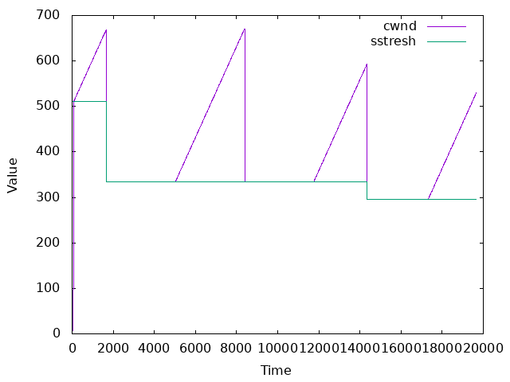
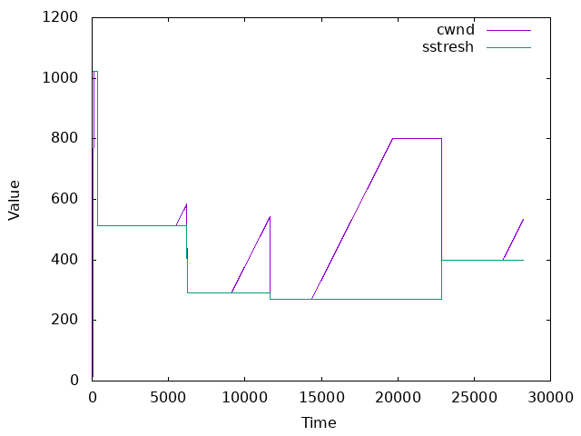
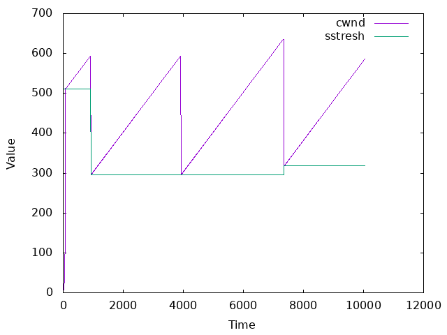
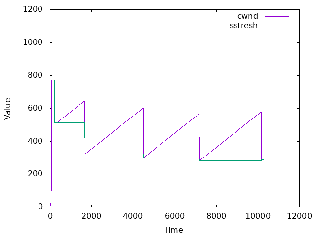
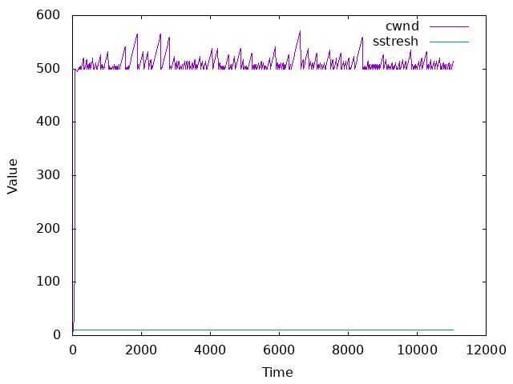
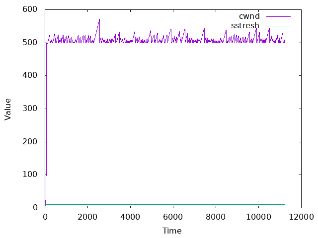

# CN_CHomeworks_4

## Contents

- [Code Documentation](#code-documentation)
  - [NewReno Class](#newreno-class)
  - [Reno Class](#reno-class)
  - [BBR Class](#bbr-class)

- [Run](#run)

- [Questions](#questions)
  - [Q1](#q1-whats-the-difference-between-congestion-control-and-the-flow-control)
  - [Q2](#q2-describe-new-renos-algorithm-shortly)
  - [Q3](#q3-describe-bbr-algorithm-shortly)
  - [Q4](#q4-whats-the-difference-between-these-three-algorithms)
  - [Q5](#q5-analyze-and-describe-these-three-algorithms)
  - [Q6](#q6-name-some-of-the-congestion-control-algorithms-that-are-not-mentioned-in-this-project)

## Code Documentation

### NewReno Class

#### Public Methods

##### The Constructor

The NewReno constructor initializes the NewReno congestion control algorithm with the following parameters:

cwnd: Initial congestion window size. It represents the number of packets that can be sent without waiting for an acknowledgment.

ssthresh: Initial slow start threshold. It determines when the algorithm transitions from the slow start phase to the congestion avoidance phase.

fileSize: Size of the file being transmitted.

rtt\*: Round-trip time. It represents the time taken for a packet to travel from the sender to the receiver and back.

losstresh\*: Loss threshold. It is used to detect loss events and trigger congestion control mechanisms.

lossScale\*: Loss scale factor. It adjusts the congestion window reduction during congestion events.

time\*: Time counter. It can be used to track the duration of the transmission or measure timing-related aspects of the algorithm.

retransRemain\_: Remaining retransmission attempts. It keeps track of the number of retransmission attempts during the fast retransmit phase.

##### `void sendData()`

The sendData() function uses a switch-case statement to determine the current mode of the algorithm and performs the corresponding actions based on the mode. The different modes include:

SLOW*START: In this mode, if the congestion window (cwnd*) is smaller than the slow start threshold (ssthresh*), the congestion window is doubled (cwnd* \*= 2). Once the congestion window exceeds the slow start threshold, the mode is switched to CONGESTION_AVOIDANCE.

CONGESTION_AVOIDANCE: In this mode, the congestion window is increased by the maximum segment size (MSS) for each successful transmission. This helps to gradually increase the sending rate while avoiding congestion.

FAST*RECOVERY: If the algorithm enters fast recovery mode, the congestion window is reduced by half (cwnd* = cwnd* / 2) and the slow start threshold is set to the current congestion window size (ssthresh* = cwnd\_). The algorithm then switches to FAST_TRANSIMIT mode.

FAST*TRANSIMIT: In this mode, the algorithm keeps track of the remaining retransmission attempts (retransRemain*). If the retransmission attempts are exhausted (retransRemain\_ <= 0), the algorithm switches back to CONGESTION_AVOIDANCE mode.

##### `void onPacketLoss(int)`

On packet loss we go to FAST_RECOVERY mode and set the retransmission attempts.

##### `void log(std::ofstream&) const`

This function logs the current state of the algorithm to the given output stream. It logs the current congestion window size (cwnd*), slow start threshold (ssthresh*), and mode.

##### `void retransmit()`

This function is called when a packet needs to be retransmitted. It decrements the retransmission attempts (retransRemain\_) and switches to FAST_RECOVERY mode.

##### `void run()`

This function runs the algorithm. It first initializes the algorithm by setting the initial congestion window size (cwnd*) and slow start threshold (ssthresh*). It then enters a loop that runs until the congestion window size reaches the maximum value (cwnd* >= maxCwnd*). In each iteration, it calls the sendData() function to send packets and handle congestion. Once the maximum congestion window size is reached, the algorithm terminates.

#### Private Methods:

##### `double lossProbability()`

This function calculates the probability of packet loss based on the current congestion window size (cwnd*) and the maximum congestion window size (maxCwnd*). It uses a linear function to calculate the probability, which increases as the congestion window size approaches the maximum value.

### Reno Class

#### Public Methods

##### The Constructor

The Reno constructor initializes the Reno congestion control algorithm with the following parameters:

cwnd: Initial congestion window size. It represents the number of packets that can be sent without waiting for an acknowledgment.

ssthresh: Initial slow start threshold. It determines when the algorithm transitions from the slow start phase to the congestion avoidance phase.

fileSize: Size of the file being transmitted.

rtt\_: Round-trip time. It represents the time taken for a packet to travel from the sender to the receiver and back.

losstresh\_: Loss threshold. It is used to detect loss events and trigger congestion control mechanisms.

lossScale\_: Loss scale factor. It adjusts the congestion window reduction during congestion events.

unacknowledged\_: Number of unacknowledged packets. It keeps track of the packets that have been sent but not yet acknowledged.

time\_: Time counter. It can be used to track the duration of the transmission or measure timing-related aspects of the algorithm.

retransRemain\_: Remaining retransmission attempts. It keeps track of the number of retransmission attempts during congestion events.

##### `void onSelectiveAck(int)`

In this function we increase retransRemain\_ and go to FAST_RECOVERY mode. Difference between this function and onPacketLoss() is that we don't set the retransmission attempts. Because all lost packet will be handled in one Recovery phase.

### BBR Class

Initialization: Before entering the BBR phases, the algorithm initializes its variables and parameters. This may involve setting the initial sending rate, configuring congestion control parameters, and initializing variables to track RTT, packet loss, and other relevant metrics.

Startup Phase: The algorithm enters the startup phase, where it rapidly increases the sending rate to probe for the available bottleneck bandwidth. It starts with a low sending rate and exponentially increases it until the bottleneck bandwidth is reached. During this phase, BBR measures the round-trip time (RTT) and monitors packet loss events to estimate the available bandwidth.

Drain Phase: Once the bottleneck bandwidth is detected, the algorithm enters the drain phase. In this phase, BBR aims to reduce the sending rate gradually, allowing any excess queued packets to be drained and stabilizing the queue occupancy at the bottleneck. The purpose of the drain phase is to avoid creating further congestion and excessive queuing delays.

Probe Bandwidth Phase: After the drain phase, BBR enters the probe bandwidth phase. Here, the algorithm maintains a stable sending rate that corresponds to the estimated available bandwidth. BBR continuously monitors and updates its estimate of the available bandwidth, adapting the sending rate to fully utilize the available capacity without causing excessive queuing delay or congestion.

Probe RTT Phase: BBR periodically enters the probe RTT phase to ensure accurate and up-to-date RTT measurements. During this phase, the algorithm intentionally reduces the sending rate to obtain precise RTT measurements. The measured RTT information is then used to refine the available bandwidth estimation and adjust the congestion control parameters if necessary.

Loop and Adaptation: The control flow of BBR typically involves iterating through the probe bandwidth and probe RTT phases multiple times. The algorithm dynamically adjusts its behavior based on observed network conditions and continually refines its estimates and control parameters to optimize throughput and minimize latency.

#### Public Methods

##### The Constructor

The BBR constructor initializes the BBR congestion control algorithm with the following parameters:

max_bw: Maximum estimated bottleneck bandwidth. It represents the upper limit of the estimated bandwidth of the network path.

min_rtt: Minimum round-trip time. It represents the lower limit of the round-trip time experienced by the network packets.

fileSize: Size of the file being transmitted.

mode\_: Initial mode of the algorithm, set to STARTUP. The algorithm dynamically adjusts the mode based on network conditions.

cwnd\_: Initial congestion window size, set to 1. It represents the number of packets that can be sent without waiting for an acknowledgment.

rtt\_: Round-trip time, initialized with a default value.

target*cwnd*: Target congestion window size, set to 500. It represents the desired number of packets in flight.

pacing*gain*: Pacing gain factor, set to 2.0. It determines the rate at which packets are transmitted.

gain*cycle*: Gain cycle length, set to 8.0. It influences the pacing gain value.

losstresh\_: Loss threshold. It is used to detect loss events and trigger congestion control mechanisms.

lossScale\_: Loss scale factor. It adjusts the congestion window reduction during congestion events.

time\_: Time counter. It can be used to track the duration of the transmission or measure timing-related aspects of the algorithm.

unacknowledged\_: Number of unacknowledged packets. It keeps track of the packets that have been sent but not yet acknowledged.

retransRemain\_: Remaining retransmission attempts. It keeps track of the number of retransmission attempts during congestion events.

##### `double getSendingRate`

It updates sending rate by pacing*gain* max to max*bandwidth*.

##### `void onBottleneck()`

It switches to Drain phase and decrease cwnd\_ by 25%.

#### Private Methods:

## Run
   You can specify Algorithms and their parameters in `src/main.cpp` file. Then just run makefile with `make` command and run `bin/main`. It makes plot files in `plots` folder and you can plot them with `./plot.sh` command (needs gnuplot). Plot images will also be in `plots` folder.

## Questions

### Q1. "What's the difference between congestion control and the flow control?"

Flow control and congestion control are two mechanisms used in computer networks to regulate the flow of data between network devices. Although they both aim to optimize network performance, they address different aspects of data transmission.

Flow control manages the flow of data between a sender and receiver to ensure that the receiving device can handle the incoming data at a pace it can handle. It prevents the sender from overwhelming the receiver with a large amount of data, which could lead to data loss or buffer overflow. Flow control typically uses techniques like buffering, sliding window protocols, and acknowledgement messages to regulate the transmission rate and ensure smooth data delivery.

Congestion control, on the other hand, deals with network-wide traffic congestion, occurring when the overall demand for network resources exceeds the available capacity. It aims to avoid or alleviate congestion by controlling the rate at which data is injected into the network. Congestion control mechanisms monitor network conditions, detect congestion signs (e.g., increased delays, packet loss), and take actions to reduce the amount of traffic being sent. These actions may include reducing the transmission rate, adjusting window sizes, or using congestion notification mechanisms to inform senders about the network state.

In summary, flow control focuses on regulating the data flow between a sender and receiver, ensuring the receiver can handle the incoming data. Congestion control, on the other hand, addresses network-wide congestion by managing the rate at which data is sent into the network to prevent overload and maintain overall network performance.

### Q2. "Describe New Reno's algorithm shortly."

New Reno is an enhancement to the Reno congestion control algorithm used in TCP (Transmission Control Protocol), which is widely employed for reliable data transmission over computer networks. New Reno improves upon Reno's congestion control mechanism by introducing a modification to the way TCP handles packet retransmissions after detecting congestion.

Reno perform very well over TCP when the packet losses are small. But when we have multiple packet losses in one window then RENO doesn’t perform too well and it’s performance is almost the same as Tahoe under conditions of high packet loss. The reason is that it can only detect a single packet losses. If there is multiple packet drop then the first info about the packet loss comes when we receive the duplicate ACK’s. But the information about the second packet which was lost
will come only after the ACK for the re-transmitted first segment reaches the sender after one RTT. Also it is possible that the CWD is reduced twice for packet losses which occurred in one window.

It differs from RENO in that it doesn’t exit fast-recovery until all the data which was out standing at the time it entered fast-recovery is acknowledged

### Q3. "Describe BBR algorithm shortly."

BBR (Bottleneck Bandwidth and Round-Trip Time) is a congestion control algorithm developed by Google for TCP (Transmission Control Protocol) to optimize network performance and throughput. It aims to efficiently utilize available network capacity by dynamically adjusting the sending rate based on network conditions.

BBR takes a different approach compared to traditional congestion control algorithms like Reno or Cubic, which primarily rely on packet loss as an indicator of network congestion. Instead, BBR focuses on two key metrics: the bottleneck bandwidth and the round-trip time (RTT) of the network.

The BBR algorithm estimates the available bottleneck bandwidth by measuring the maximum number of bytes that can be transmitted through the network without causing queuing delay. It does this by continuously probing the network with small bursts of packets and observing the resulting RTT variations.

Based on the observed bottleneck bandwidth and RTT, BBR dynamically adjusts the sending rate to maximize network utilization without causing excessive queuing delay. It strives to maintain a low queue occupancy at the bottleneck link to minimize delay and maximize throughput.

BBR utilizes a congestion model called the "BBR gain cycle" to calculate the sending rate. It consists of four phases: Startup, Drain, ProbeBW, and ProbeRTT. During Startup, BBR rapidly increases the sending rate until it detects congestion. In the Drain phase, it reduces the rate to empty the queue. The ProbeBW phase explores the available bandwidth, and the ProbeRTT phase refines the RTT estimation for more accurate control.

By continuously monitoring the bottleneck bandwidth and RTT, BBR adapts its sending rate in real-time to maintain optimal network utilization while minimizing queuing delay. This allows BBR to achieve higher throughput and better performance in diverse network conditions, making it particularly effective for modern high-speed networks and long-distance connections.

### Q4. "What's the difference between these three algorithms."

Reno, New Reno, and BBR are three different congestion control algorithms used in TCP (Transmission Control Protocol) for managing data transmission over computer networks. Here are the key differences between these algorithms:

1. Reno:
   Reno is one of the earliest and most widely deployed congestion control algorithms. It uses a combination of slow-start and congestion avoidance techniques to regulate the sending rate. When congestion is detected based on packet loss, Reno reduces the congestion window (cwnd) and enters a slow-start phase, gradually increasing cwnd to probe for available network capacity. It then enters congestion avoidance, incrementing cwnd more cautiously to maintain network stability. Reno is known for its simplicity but can suffer from global synchronization issues when multiple connections sharing a bottleneck link experience simultaneous congestion events.

2. New Reno:
   New Reno is an enhancement to the Reno algorithm designed to address the global synchronization problem. When a packet loss is detected, New Reno enters a fast recovery phase instead of slow-start. In fast recovery, it increases the congestion window by a smaller value and relies on receiving duplicate acknowledgments (ACKs) to retransmit lost packets. This approach allows New Reno to recover from losses more quickly and avoid unnecessary slow-start episodes, improving overall network performance. New Reno is backward compatible with Reno and is widely used in modern TCP implementations.

3. BBR (Bottleneck Bandwidth and Round-Trip Time):
   BBR is a congestion control algorithm developed by Google. It takes a different approach from Reno and New Reno by focusing on the estimation of bottleneck bandwidth and round-trip time (RTT) to optimize network performance. BBR dynamically adjusts the sending rate based on these metrics rather than relying solely on packet loss as an indicator of congestion. By continuously probing the network and observing RTT variations, BBR estimates the available bottleneck bandwidth and adjusts the sending rate to maximize network utilization without causing excessive queuing delay. BBR aims to achieve high throughput and low delay by maintaining a low queue occupancy at the bottleneck link. It is particularly effective for high-speed networks and long-distance connections.

In summary, Reno is a classic congestion control algorithm, New Reno is an enhancement to address global synchronization, and BBR is a modern algorithm that optimizes throughput and delay by dynamically adjusting the sending rate based on bottleneck bandwidth and RTT measurements.

### Q5. "Analyze and describe these three algorithms."

First phase of these algorithms are almost same. We have possible loss in all of them but BBR handle it better than others. Also BBR has the best throughput and lowest RTT. When loss happens, BBR goes to Drain phase and decrease the cwnd slowly. But in Reno and NewReno they go to Fast Recovery phase and cwnd halves. If we have multiple loss in one window, NewReno is better than Reno because it doesn't halve the cwnd again and again. But BBR is better than both of them because it doesn't halve the cwnd at all.

Best algorithm for high-speed networks is BBR as we see in images. But for low-speed networks, Reno and NewReno could be as good as BBR.


&emsp;

## Reno

```cpp
// cwnd = 1, ssthresh = 511, loss_scale = 0.015
Reno reno1(1, 511, 0.015, FILE_SIZE, "Reno_1");
reno1.run();
```
Output:
```
Reno_1: Pacekt loss at time 1670: cwmd = 669, sstresh = 511
Fast recovery end at time 5020
Reno_1: Pacekt loss at time 8400: cwmd = 671, sstresh = 334
Fast recovery end at time 11760
Reno_1: Pacekt loss at time 14350: cwmd = 593, sstresh = 335
Fast recovery end at time 17320
```


&emsp;

&emsp;

```cpp
// cwnd = 1, ssthresh = 1023, loss_scale = 0.015
Reno reno2(1, 1023, 0.015, FILE_SIZE, "Reno_2");
reno2.run();
```
Output:
```
Reno_2: Pacekt loss at time 100: cwmd = 1024, sstresh = 1023
Reno_2: Pacekt loss at time 110: cwmd = 1024, sstresh = 1023
Reno_2: Pacekt loss at time 160: cwmd = 1024, sstresh = 1023
Reno_2: Pacekt loss at time 170: cwmd = 1024, sstresh = 1023
...
...
Reno_2: Pacekt loss at time 300: cwmd = 1024, sstresh = 1023
Reno_2: Pacekt loss at time 310: cwmd = 1024, sstresh = 1023
Reno_2: Pacekt loss at time 340: cwmd = 1024, sstresh = 1023
Fast recovery end at time 5470
Reno_2: Pacekt loss at time 6200: cwmd = 584, sstresh = 512
Fast recovery end at time 9130
Reno_2: Pacekt loss at time 11650: cwmd = 543, sstresh = 292
Fast recovery end at time 14370
Reno_2: Pacekt loss at time 19670: cwmd = 800, sstresh = 271
Reno_2: Pacekt loss at time 19680: cwmd = 800, sstresh = 271
Reno_2: Pacekt loss at time 19690: cwmd = 800, sstresh = 271
...
...
Reno_2: Pacekt loss at time 22860: cwmd = 800, sstresh = 271
Reno_2: Pacekt loss at time 22870: cwmd = 800, sstresh = 271
Fast recovery end at time 26880
```


As we see in output, by increasing sstresh, more loss will occure, but average cwnd is almost same in both of them because of congestion control set cwnd in according to network condition and loss scale is same in both of them.

&emsp;

## NewReno

```cpp
// cwnd = 1, ssthresh = 511, loss_scale = 0.015
NewReno newReno1(1, 511, 0.015, FILE_SIZE, "NewReno_1");
newReno1.run();
```
Output:
```
NewReno_1: Pacekt loss at time 910: cwmd = 593, sstresh = 511
NewReno_1: Pacekt loss at time 3910: cwmd = 593, sstresh = 296
NewReno_1: Pacekt loss at time 7340: cwmd = 636, sstresh = 296
```



Diffrence of Reno and NewReno is obvious here. When loss occure Reno need more time to recover from it. But NewReno recover from loss faster in one Recovery phase.

Time needed for Reno to send File is about 20000 and for NewReno is about 11000.

&emsp;

&emsp;

```cpp
// cwnd = 1, ssthresh = 1023, loss_scale = 0.015
NewReno newReno2(1, 1023, 0.015, FILE_SIZE, "NewReno_2");
newReno2.run();
```
Output:
```
NewReno_2: Pacekt loss at time 100: cwmd = 1024, sstresh = 1023
NewReno_2: Pacekt loss at time 110: cwmd = 1024, sstresh = 1023
NewReno_2: Pacekt loss at time 120: cwmd = 1024, sstresh = 1023
NewReno_2: Pacekt loss at time 130: cwmd = 1024, sstresh = 1023
NewReno_2: Pacekt loss at time 140: cwmd = 1024, sstresh = 1023
NewReno_2: Pacekt loss at time 150: cwmd = 1024, sstresh = 1023
NewReno_2: Pacekt loss at time 160: cwmd = 1024, sstresh = 1023
NewReno_2: Pacekt loss at time 170: cwmd = 1024, sstresh = 1023
NewReno_2: Pacekt loss at time 180: cwmd = 1024, sstresh = 1023
NewReno_2: Pacekt loss at time 190: cwmd = 1024, sstresh = 1023
NewReno_2: Pacekt loss at time 200: cwmd = 1024, sstresh = 1023
NewReno_2: Pacekt loss at time 1670: cwmd = 646, sstresh = 512
NewReno_2: Pacekt loss at time 4480: cwmd = 601, sstresh = 323
NewReno_2: Pacekt loss at time 7180: cwmd = 567, sstresh = 300
NewReno_2: Pacekt loss at time 10170: cwmd = 579, sstresh = 283
```



By increasing sstresh, more loss will occure, but in cotrast to Reno, loss is much more less in NewReno. And as we see in output, NewReno recover from loss faster than Reno.

&emsp;

&emsp;

## BBR

```cpp
// max_bw = 10, min_rtt = 10, loss_scale = 0.015
BBR bbr1(10, 10, 0.015, FILE_SIZE, "BBR_1");
bbr1.run();
```
Output:
```

```



Time needed for BBR to send File is about 11000 like NewReno. but its cwnd and throughput is more stable than NewReno. And as we wee in output, no loss occured because of congestion avoidance behavior of BBR.

&emsp;

&emsp;

```cpp
// max_bw = 10, min_rtt = 10, loss_scale = 0.02
BBR bbr2(10, 10, 0.02, FILE_SIZE, "BBR_2");
bbr2.run();
```
Output:
```
BBR_2: Pacekt loss at time 1340.8: cwmd = 500, RTT = 10.941
BBR_2: Pacekt loss at time 1692.43: cwmd = 503, RTT = 11.0278
BBR_2: Pacekt loss at time 3674.09: cwmd = 503, RTT = 11.1826
BBR_2: Pacekt loss at time 3853.04: cwmd = 506, RTT = 11.1858
BBR_2: Pacekt loss at time 4322.98: cwmd = 515, RTT = 11.1917
BBR_2: Pacekt loss at time 4804.31: cwmd = 500, RTT = 11.1952
BBR_2: Pacekt loss at time 5106.6: cwmd = 524, RTT = 11.1966
BBR_2: Pacekt loss at time 5722.47: cwmd = 524, RTT = 11.1983
BBR_2: Pacekt loss at time 5901.64: cwmd = 542, RTT = 11.1986
BBR_2: Pacekt loss at time 6943.17: cwmd = 509, RTT = 11.1996
BBR_2: Pacekt loss at time 9664.74: cwmd = 512, RTT = 11.2
```



With 0.015 loss_scale, BBR didn't have any loss. But with 0.02 loss_scale, BBR had some loss. But it recovered from loss very fast and its throughput is more stable than NewReno.

&emsp;

&emsp;

### Q6. "Name some of the congestion control algorithms that are not mentioned in this project."

One congestion control algorithm that is commonly used in computer networks is called "Cubic." Cubic is a TCP congestion control algorithm that aims to provide high throughput and fairness in network traffic. It uses a cubic function to determine the appropriate congestion window size based on network conditions.

Cubic is designed to be scalable and efficient in modern high-speed networks. It adjusts the congestion window dynamically by estimating the network's bandwidth and round-trip time. The algorithm strives to achieve fairness by adapting the sending rate to congestion signals while maximizing network utilization.

Cubic has been widely implemented in various operating systems and networking frameworks, and it has become a standard congestion control algorithm in many modern network stacks.

Cubic has several advantages and characteristics that make it a superior congestion control algorithm in certain scenarios. Here are a few reasons why Cubic may be considered superior to other congestion control algorithms in specific criteria:

1. Scalability: Cubic is designed to perform well in high-speed networks, making it particularly suitable for modern networks with large bandwidth capacities. It achieves scalability by using a cubic function to control the congestion window size, allowing it to adapt to varying network conditions more efficiently.

2. Fairness: Cubic aims to provide fairness among competing flows sharing the same network resources. It achieves fairness by adapting the sending rate based on congestion signals and the available bandwidth. This ensures that all flows get a fair share of the network capacity, preventing a single flow from dominating the network.

3. Responsiveness: Cubic is designed to be responsive to changes in network conditions. It uses an algorithm that approximates the congestion window growth in a cubic manner, allowing it to react quickly to network congestion or changes in available bandwidth. This responsiveness helps to mitigate congestion and maintain optimal network performance.

4. Stability: Cubic is known for its stability and low packet loss rates. It uses a window growth model that results in a smooth increase in sending rates, preventing sudden bursts or rapid drops in congestion window size. This stability leads to improved network performance and reduced packet loss.

It's important to note that the effectiveness of congestion control algorithms can vary depending on the network environment and specific use cases. Different algorithms may perform better under different conditions, and the choice of algorithm often depends on factors such as network topology, latency, and available bandwidth. Network administrators and researchers continually evaluate and develop new congestion control algorithms to address the evolving needs of modern networks.
